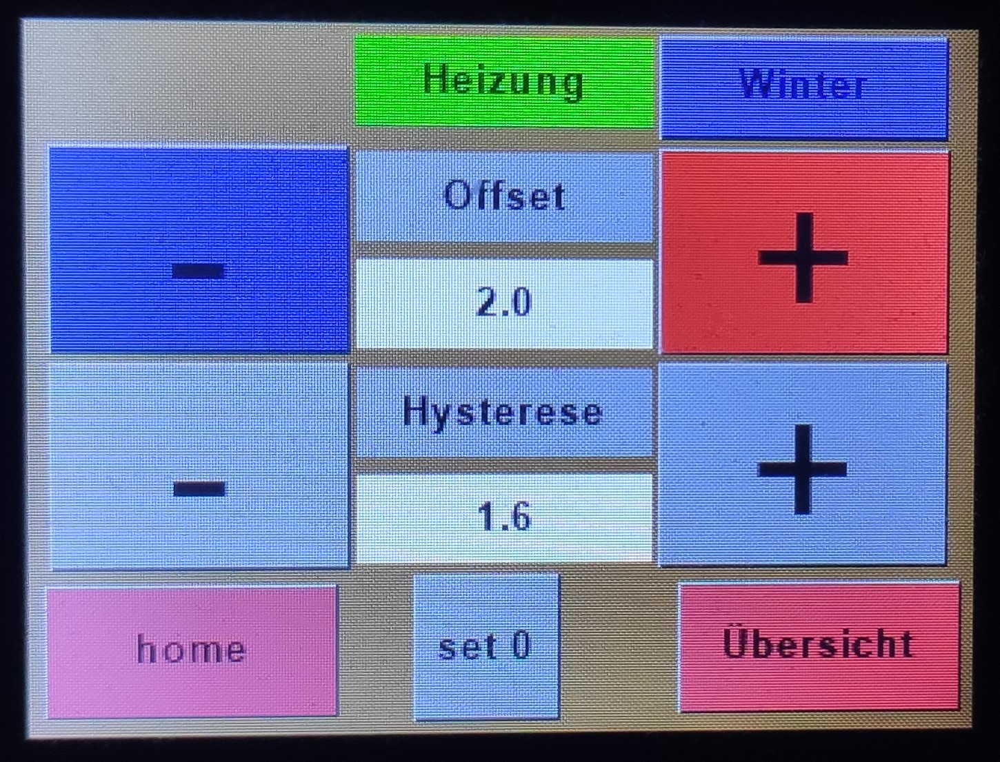

# ArduHeatPumpControl

ArduHeatPumpControl V1.0
Arduino based heat pump control unit with touch screen by Zeppelin500

Developed for a water-water heat pump but also usable for a brine-water heat pump.
Main components are an Arduino Mega, a Nextion display NX3224K024_11 and onewire DS18B20 sensors

I´ve devoloped it for my defect Dimplex WI9TE control unit (Wärmepumpenmanager) but it should be work in the most HPs with a thermostatic expansion valve.

### Programmed are (only) the basic usecases that I use:
* outside temperature controlled (heating curve)
* Summer / Winter mode
* direct underfloor heating without a mixer
* (drink) water heating
* water heating is preffered before heating
* electric provider blocking (EVU-Sperre)

### Highlights:
* touch display with differend pages to control and manipulate
* some safety precautions (high/low pressure, icing, flow,  prof of plausibility of all temperatures, watchdog)
* Error memory with timestamp and state of all readings in EEPROM
* RTC
* heating curve offset and both hyseresis can be manipulated by the touch (heating curve is hardcoded)
* 6 independend onewire buses implemented, so you can replace a sensor without touch the software

The Project includes 2 files. The Arduino .ino file and the .hmi file for the Nextion display.
Although the display is high potent the "intelligence" is only written to the Arduino code. The Display is only used for show values and notice touch buttons. 
Also the build in rtc with the battery is used for the Arduino time.   

Many thanks to Seithan for the unbelivable Nextion libary "EasyNextionLibrary"! The Libary was the key to deal with the touch "easy".

## Warning:
If you try to implement the control unit to your heat pump, you should educated as electrician, you have to deal with 400V!
This code ist in real operation since about 10 month and it work perfect. But! If you not know what you do, may be your compressor get damaged.

## Note: 
At the moment GUI and most comments are in german language. Because I wrote it for myself. If some interest, may I translate it sometimes.

## Known issues:
First I´ve used for the pressure failurs hardware interrupts. But I had some EMC problems, so I comment it out and programmed the failure detecting (laborius) by hand around the switching moment of the contactor (causer of the emc problems).
The EMC problems are now fixed but the code work reliable. At the moment I´m not sure should I delete or reimplement the interrupts. 

****************************************************
This program is free software: you can redistribute it and/or modify it under the terms of the GNU General Public License as published by
the Free Software Foundation, either version 3 of the License, or (at your option) any later version. This program is distributed in the hope that it will be useful,
but WITHOUT ANY WARRANTY; without even the implied warranty of MERCHANTABILITY or FITNESS FOR A PARTICULAR PURPOSE.  See the GNU General Public License for more details.
You should have received a copy of the GNU General Public License along with this program.  If not, see <http://www.gnu.org/licenses/>.
****************************************************

